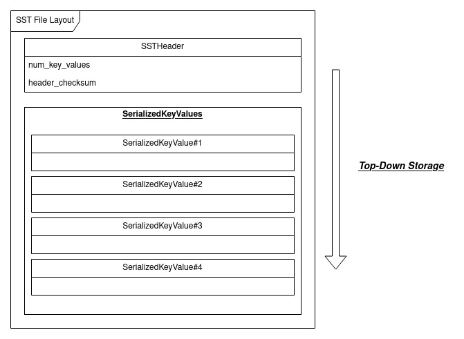
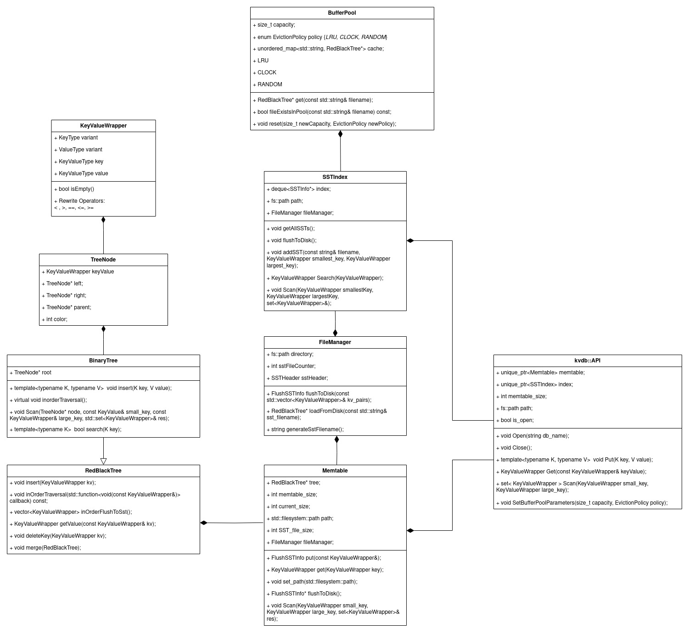

## KvDB


Persistent key-value store database library. The KV-Storage database is a high-performance system designed to store 
key-value pairs and allow efficient retrieval based on the key. This system is inspired by modern databases like 
[LevelDB](https://github.com/google/leveldb) and [RocksDB](https://github.com/facebook/rocksdb), and supports multiple data types using C++ templates and Protocol Buffers.


### Operations

#### **kvdb::API::Open(string db_name)**
Initializes the database system, setting up the necessary files and directories (including SSTs and related data). Can be initialized with a custom Memtable size or default size of `1e4`.

```c++
// Initialize with default memtable size
auto MyDBDefault = std::make_unique<kvdb::API>();
MyDBDefault->Open("database_name");

// Initialize with a custom memtable size
int memtableSize = 1e3;
auto MyDBCustom = std::make_unique<kvdb::API>(memtableSize);
MyDBCustom->Open("database_name");
```

#### **template<typename K, typename V> kvdb::API::Put(K key, V value)**
Inserts a key-value pair into the database, where both the key and value can be of various types (int, double, string, etc.).

```c++
// Example of inserting different data types
auto MyDB = std::make_unique<kvdb::API>();
MyDB->Open("database_name");
MyDB->Put(1, 100);             // int -> int
MyDB->Put(1.5, 'A');           // double -> char
MyDB->Put("Hello", 1e8LL);     // string -> long long
```

#### **kvdb::API::Get(const KeyValueWrapper& key)**
Retrieves a value from the database based on the key. Supports multiple data types.

```c++
// Example of retrieving values
auto MyDB = std::make_unique<kvdb::API>();
MyDB->Open("database_name");
MyDB->Put(1, 100);
MyDB->Put(1.5, 'A');
MyDB->Put("Hello", 1e8LL);

// Retrieve the value by key
auto kv = MyDB->Get("Hello");
// Retrieve the value by `KeyValueWrapper` instance
auto kv = MyDB->Get(KeyValueWrapper("Hello", ""));
// Expected output: { key: "Hello", value: 1e8LL }
```

#### **kvdb::API::Close()**
Closes the database, flushing any data in memory (Memtable) to disk and storing it in SSTs.

```c++
// Close the database and flush the Memtable to disk
auto MyDB = std::make_unique<kvdb::API>();
MyDB->Open("database_name");
MyDB->Close();
```

#### **kvdb::API::Scan(KeyValueWrapper smallestKey, KeyValueWrapper largestKey)**
Scans the database for key-value pairs within a specified key range. The results are returned in sorted key order.

```c++
// Scan for key-value pairs within a range
auto MyDB = std::make_unique<kvdb::API>();
MyDB->Open("database_name");
// Scan by key
std::set<KeyValueWrapper> results = MyDB->Scan(1, 10);
// Scan by `KeyValueWrapper` instance
std::set<KeyValueWrapper> results = MyDB->Scan(KeyValueWrapper(1, ""), KeyValueWrapper(10, ""));
```
#### **kvdb::API::SetBufferPoolParameters(size_t capacity, EvictionPolicy policy)**
Set/reset buffer pool `size_t::` **capacity** and `EvictionPolicy::` **policy** (`LRU`, `CLOCK`, `RANDOM`)
```c++
EvictionPolicy newPolicy = EvictionPolicy::LRU;
EvictionPolicy newPolicy = EvictionPolicy::CLOCK;
EvictionPolicy newPolicy = EvictionPolicy::RANDOM;
```
> This method will clear all the previous cache in the buffer pool.

```c++
// Open the database
auto MyDB = std::make_unique<kvdb::API>();
MyDB->Open("database_name");

// Set buffer pool parameters
size_t Capacity = 20;
EvictionPolicy Policy = EvictionPolicy::CLOCK;
MyDB->SetBufferPoolParameters(newCapacity, Policy);

// Reset 
size_t newCapacity = 100;
EvictionPolicy Policy = EvictionPolicy::LRU;
MyDB->SetBufferPoolParameters(newCapacity, Policy);

// Perform database operations
MyDB->Put(1, "value1");
KeyValueWrapper value = MyDB->Get(1);

// Close the database
MyDB->Close();
```

#### **kvdb::API::Update()** (Coming Soon)
This will allow the updating of key-value pairs within the database.

#### **kvdb::API::Delete()** (Coming Soon)
This will allow the deletion of key-value pairs from the database.

### Supported Data Types
> 2024-09-12 Restructure with `Protobuf`

> 2024-09-09 Support Template<typename K, typename V>
```c++
enum KeyValueType { INT, LONG, DOUBLE, CHAR, STRING };
```

> 2024-08-28 Support <int_64, int_64>

### SST file layout


> Using **Protocol Buffer** for data serialization

```protobuf
syntax = "proto3";
message KeyValue {
  oneof key {
    int32 int_key = 1;
    int64 long_key = 2;
    double double_key = 3;
    string string_key = 4;
    string char_key = 5;  // Protobuf doesn't have a char type,  use a single-character string
  }

  oneof value {
    int32 int_value = 6;
    int64 long_value = 7;
    double double_value = 8;
    string string_value = 9;
    string char_value = 10;
  }

  enum KeyValueType {
    INT = 0;
    LONG = 1;
    DOUBLE = 2;
    CHAR = 3;
    STRING = 4;
  }

  KeyValueType key_type = 11;
  KeyValueType value_type = 12;
}
```
### Dataflow Diagram


### UML



### Supported Platforms and Compilers
The KV-Store system has been tested across multiple platforms and compilers. Below is the current support status:

| Platform     | Compiler       | Status |
|--------------|----------------|--------|
| Ubuntu ARM64 | GCC            | ✅     |
| Ubuntu ARM64 | Clang          | ✅     |
| Windows x86  | MSVC (cl)      | ✅     |


### Roadmap & Features
- **2024-09-12**: Restructure data storage, better performance with protobuf serialization / deserialization.
- **2024-09-09**: Added support for templates using `KeyValueWrapper` class for multi-type key-value storage.
- **2024-08-28**: Initial support for `<int64, int64>` pairs.
- Future updates will include delete and update operations, along with optimizations for large-scale operations.


### Protobuf Instruction
```shell
cd KvDB/protobuf
protoc --proto_path=. --cpp_out=. className.proto
```